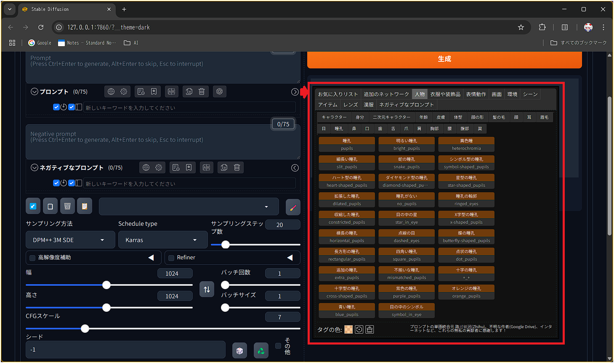

# sd-webui-floating-keyword-panel

> 💬 sd-webui-prompt-all-in-one の Keyword Grouping / One-Click Keyword Addition パネルを  
> CSS-only でフロート表示にする拡張機能

---

## 🎯 機能概要

- **Keyword Grouping / One-Click Keyword Addition** パネルを  
  画面上に固定（フロート）して常に表示  
- CSS のみで実装しているので、WebUI 本体や他の拡張を変更不要  
- パネルがスクロールに追従することで、どの画面位置でも即座にキーワード操作が可能

---

## 🖼️ 見た目

以下は **Keyword Grouping / One-Click Keyword Addition** パネルを  
画面上にフロート表示させた例です。



## 🚀 インストール方法

1. WebUI の `extensions` フォルダへクローン  
   ```bash
   cd stable-diffusion-webui/extensions
   git clone https://github.com/weizlogy/sd-webui-floating-keyword-panel.git
